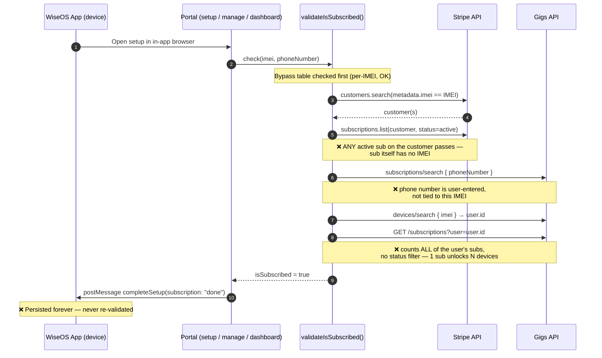
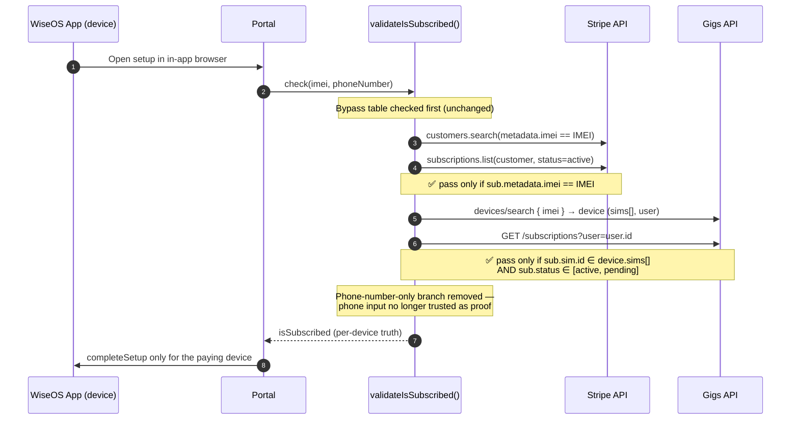
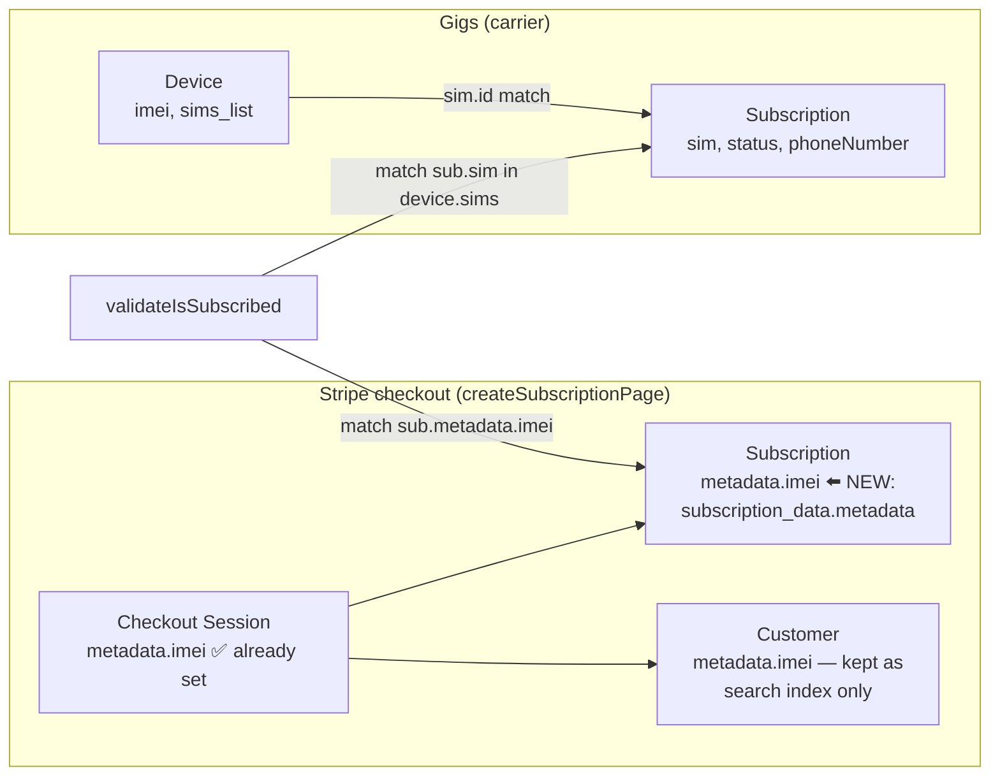

# Plan: Per-Device (IMEI) Subscription Validation

**Status:** Draft — pending team review
**Repos affected:** `wisephone-ii-portal` (all code changes), `wiseos` (no changes in phase 1; see Phase 4)
**Author:** Alex + agent analysis, Aug 14, 2026

---

## 1. Problem

The subscription check answers "does this user/customer have *a* subscription?" instead of
"does *this device* (IMEI) have a subscription?"

Concrete failure: a user with 3 registered devices and 1 subscription can verify **all 3
devices**, because the check passes as soon as at least one subscription exists anywhere
on their account.

All verification surfaces funnel through one function — `validateIsSubscribed()` in
`src/libs/stripe.ts` — so the fix is centralized, but the flaw exists independently in
**both** payment providers it queries, plus one replay hole in the Stripe checkout flow:

| # | Leak | Where | Detail |
|---|------|-------|--------|
| 1 | Gigs IMEI branch counts **user-level** subs | `src/libs/stripe.ts` (~L89–123) | IMEI → device → `user.id` → list *all* subs for user → `length > 0` = subscribed. No status filter either (canceled subs count). |
| 2 | Gigs phone branch trusts user-entered phone | `src/libs/stripe.ts` (~L67–87) | Searches subs by phone number typed into the portal. Entering the subscribed device's number verifies any device. |
| 3 | Stripe validates the **customer**, not the sub | `src/libs/stripe.ts` (~L28–62) | Finds customer by `metadata.imei`, then passes if the customer has *any* active sub. Subscriptions never record which IMEI they pay for. |
| 4 | Stripe session replay re-stamps IMEI | `src/actions/stripe.ts` `validateSubscription` | Takes `sessionId` + `imei` as independent URL-derived inputs and stamps the given IMEI onto the session's customer. Visiting `/manage/<other-imei>?session_id=<paid-session>` verifies a different device. |

### Why this persists forever on-device

WiseOS (mobile) never re-checks. During setup the portal posts
`{action: "completeSetup", imei, phone, subscription: "done"}` into the webview and the
app persists that flag permanently (`isWisephoneSetup` in `wiseos/src/entrypoint.ts`).
Ongoing enforcement is only via Knox group membership (subscribed vs. unpaid groups),
which is assigned by the same flawed check.

---

## 2. Current flow (broken)

---

## 3. Target flow

### Where the IMEI ↔ subscription link comes from

---

## 4. Work phases

### Phase 1 — Stamp IMEI onto Stripe subscriptions (new checkouts)
*File: `src/actions/stripe.ts`*

1. In `createSubscriptionPage`, add `subscription_data: { metadata: { imei } }` to
   `checkout.sessions.create` so every new subscription carries its IMEI. (Session
   metadata already has it; it just doesn't propagate to the subscription.)
2. In `validateSubscription`, before stamping the customer:
   - Retrieve the session and **require `session.metadata.imei === input.imei`**;
     reject on mismatch. This closes the session-replay hole (leak #4).
   - Keep the customer-metadata stamp (it remains the search index), but it is no
     longer proof of payment by itself.

### Phase 2 — Backfill existing Stripe subscriptions
*New one-off script: `scripts/backfill-stripe-sub-imei.ts`*

1. Iterate active subscriptions; for each, locate its originating checkout session
   (`checkout.sessions.list({ subscription })`) and copy `session.metadata.imei` to
   `subscription.metadata.imei`.
2. Fall back to the customer's `metadata.imei` when the session has none.
3. Emit a report of subscriptions that could not be attributed to an IMEI — these need
   manual resolution before enforcement (Phase 5).

### Phase 3 — Fix the validator
*File: `src/libs/stripe.ts` (`validateSubscription` / `validateIsSubscribed`)*

1. **Stripe branch:** after listing a customer's active subs, pass only if some sub has
   `metadata.imei === imei`.
2. **Gigs IMEI branch:** fetch the device (already done) but keep its `sims[]`; list the
   user's subscriptions, pass only if a sub satisfies **both**:
   - `sub.sim.id` ∈ `device.sims[].id` (or `sub.phoneNumber` matches a SIM's number), and
   - `sub.status` ∈ `["active", "pending"]`.
3. **Gigs phone branch:** remove it as an independent pass. (Optional courtesy lookup can
   remain for UX/diagnostics but must not return `isSubscribed = true` on its own.)
4. Bypass table (`BypassTechlessSubscription`) behavior unchanged — it stays the escape
   hatch for support cases.

### Phase 4 — Shadow mode, then enforce
1. Ship Phases 1–3 behind a flag: run **both** old and new logic, return the old result,
   log disagreements (`devLog` + a structured log line with imei/provider/old/new).
2. Review disagreement logs for ~1–2 weeks of real traffic; resolve unattributed subs
   from the Phase 2 report.
3. Flip to enforcing the new result. Keep the comparison log temporarily.

### Phase 5 (follow-up, separate effort) — Ongoing re-validation
Out of scope for this fix but recommended next:
- Devices already verified stay unlocked forever (`subscription: "done"` persisted in
  the app). Add periodic re-validation — either portal-driven (Knox group demotion on
  lapse, which already partially exists via group assignment) or app-driven (re-check on
  config fetch, which happens every 4h against `api.getwisephone.com`).

---

## 5. Risks & mitigations

| Risk | Mitigation |
|------|------------|
| Legit paying users fail the new check (old subs missing IMEI metadata) | Phase 2 backfill + Phase 4 shadow mode surfaces every would-be regression before enforcement |
| Gigs `sim`/`sims[]` data quality (transferred SIMs, eSIM swaps) | Shadow-mode logs will quantify; accept `sub.phoneNumber` ↔ device SIM number as secondary match |
| Family plans / one payer for multiple devices — is 1 sub per device actually the business rule? | **Confirm with the team before Phase 3.** If multi-device subs are legitimate, model as quantity/entitlement count instead of boolean |
| Support burden during cutover | Bypass table already exists as a per-IMEI override; document it for support |

## 6. Open questions for the team

1. Is "one subscription = one device" the intended business rule everywhere (Techless
   direct via Stripe *and* C-Spire/Gigs)?
2. Do any known customers legitimately share a Stripe customer across devices (e.g.,
   yearly plan covering a family)? Affects the entitlement model.
3. Who owns running the Stripe backfill against live mode, and do we have a test-mode
   dataset that reproduces the 3-devices-1-sub case?
4. Acceptable shadow-mode duration before enforcement?

## 7. Test plan

- Unit tests for the new matching logic (Stripe sub-metadata match; Gigs SIM match;
  status filtering) with mocked API responses.
- Test-mode Stripe: reproduce 3-devices-1-sub, verify only the paying IMEI passes; verify
  session-replay attempt (`/manage/<B>?session_id=<A>`) is rejected.
- Regression: bypass-table device still passes; fresh checkout for device B while A is
  subscribed → both pass, each on its own sub.
